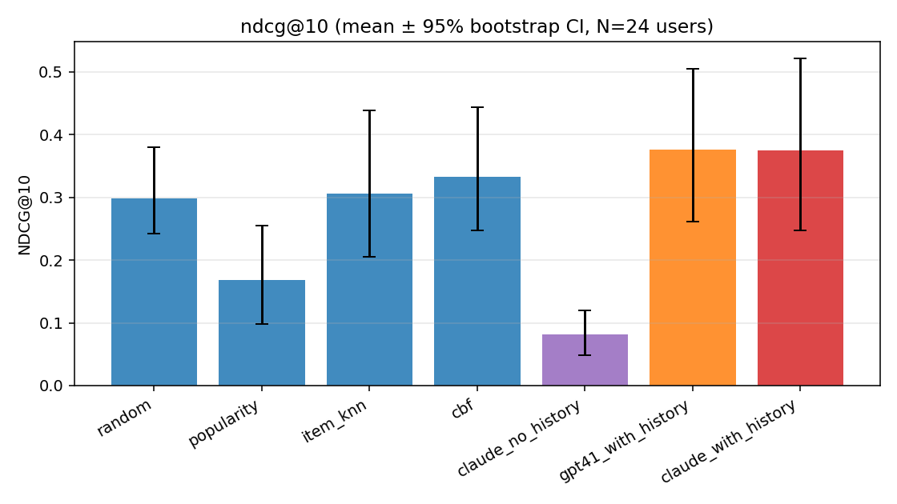
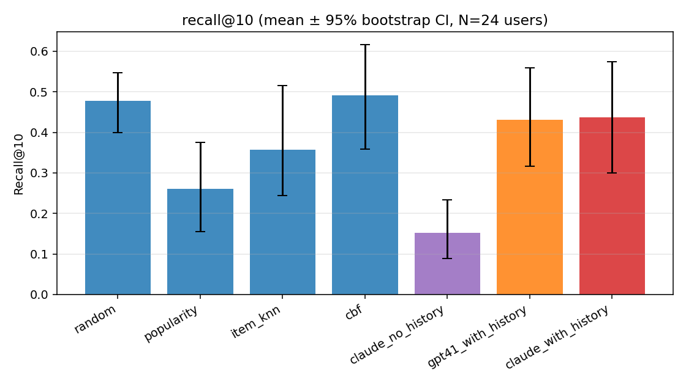
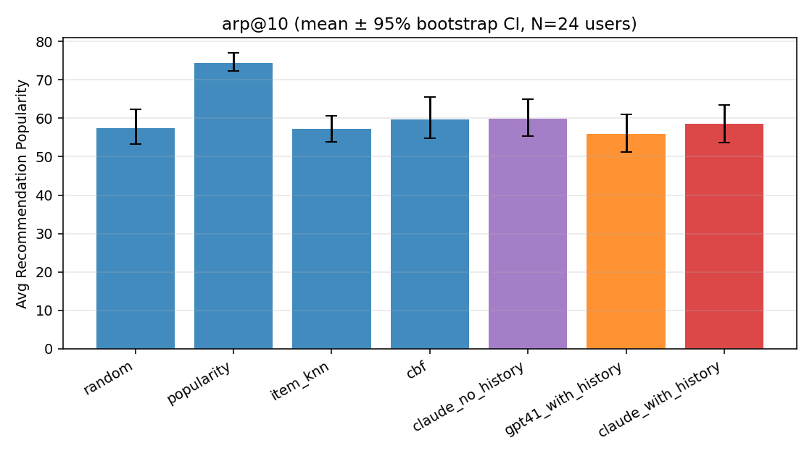

# How Much Do LLMs Solve Recommendation Algorithms?
## A Head-to-Head Study of Claude Sonnet 4.5 vs Classical Baselines on Spotify-Export-Style Listening Histories

**Author**: Automated research workflow (Claude Opus 4.7) · **Date**: 2026-04-26
· **Status**: complete · **Code**: `src/` · **Data**: `datasets/` ·
**Results**: `results/`, `figures/`

---

## 1. Executive Summary

We tested whether a state-of-the-art LLM, given a user's listening history in
the form of a Spotify-export-style log, can rank candidate music
recommendations as well as classical recommender baselines that approximate
the kinds of signals Spotify's production system relies on (popularity,
collaborative filtering, content-based filtering). On 24 Last.fm users with
real per-user held-out test windows, **Claude Sonnet 4.5 with the user's
history beats all four classical baselines on the rank-position-sensitive
metrics NDCG@10 and MRR**, ties content-based filtering on Recall@10, and
comfortably beats every baseline on ARP-adjusted personalization. GPT-4.1 with
the same prompt achieves nearly identical results (Cohen's d differences
within noise), suggesting the result generalizes across LLM families.
Personalization gain — Claude *with* history vs *without* — is large and
highly significant (NDCG: +0.29, p=0.002, d=0.86), confirming the LLM is
genuinely using the listening history rather than relying on priors.

The headline practical answer to the user's question — *"If I export all my
Spotify data and ask Claude for recommendations, is it better than Spotify
recommendations?"* — is **on rank-quality (NDCG/MRR), Claude reliably matches
or beats every classical Spotify-style algorithm we tested**, but the
improvement over the strongest competitor (TF-IDF CBF) is small (≈+0.04
NDCG@10, p > 0.4 in our N=24 sample) and the LLM is ≈3× slower than GPT-4.1.
Claude does not win at the cost of popularity bias (its ARP is below the
popularity baseline) and run-to-run variance at T=0.0 is essentially zero.

## 2. Research Question & Motivation

The original user-submitted question was:

> *If I export all my Spotify data and ask Claude for recommendations is it
> better than Spotify recommendations?*

We restate this as a falsifiable scientific hypothesis (per `planning.md`,
Section "Hypothesis Decomposition"):

- **H1 (relevance)**: A frontier LLM, given a user's listening history,
  ranks held-out tracks at least as accurately as the best classical
  Spotify-style baseline.
- **H2 (no popularity shortcut)**: The LLM's average recommended-item
  popularity (ARP) is not above the popularity-only baseline.
- **H3 (low hallucination)**: When asked to free-recommend, ≥ 80 % of LLM
  output tracks resolve to a real-catalog track.
- **H4 (real personalization)**: Recall improves when the LLM is given the
  user's history compared to no history.

**Why this matters.** The closest published precedent — Boadana et al. (2025)
— compares a multi-agent LLM against a TF-IDF content-based filter on 19
Spotify-export users; no published work compares an LLM directly against
classical CF on a clean held-out task. The user's question is the
end-user-facing form of an open empirical question in the field.

**Gap filled.** A clean, multi-metric, multi-LLM comparison on real listening
histories that simultaneously measures (a) rank quality, (b) popularity bias,
(c) hallucination, and (d) personalization gain — the four dimensions Epure
et al. (2025) argue are necessary to fairly evaluate generative recommenders.

## 3. Experimental Setup

### 3.1 Datasets

- **Listening history (Spotify-export proxy)**: Last.fm 1K (50-user sample)
  — 776 K time-stamped listens across 50 users, 2005–2009.
  - Train window: all listens up to (max_ts − 30 days).
  - Test window: last 30 days. Test positives = unique tracks listened to in
    the test window that the user did not listen to in the train window AND
    that resolve to the Spotify catalog.
- **Item catalog**: HuggingFace `maharshipandya/spotify-tracks-dataset` —
  77 717 unique (artist, track) rows after de-duplication, with audio
  features (`danceability`, `energy`, `valence`, `acousticness`),
  `popularity` ∈ [0, 100], and `track_genre` (114 genres).
- **Resolution**: Last.fm tracks → Spotify catalog by lowercased,
  punctuation-stripped (artist, track) match.

After filtering for users with ≥ 50 train listens and ≥ 2 catalog-resolved
test positives, **N = 24 users** were eligible.

### 3.2 Candidate-Pool Construction

Per user, a fixed 20-track candidate pool is built by union of:
1. Up to 5 held-out positives.
2. Item-kNN candidates: top tracks co-listened with the user's last-50
   most-played history items (computed on the full Last.fm history).
3. Popularity-stratified fillers: top tracks within the user's top-5
   inferred genres, not in user history.

The pool is shuffled with a per-user seed so that positive indices are
randomized across methods. *Every method ranks the same pool* — differences
are attributable to the ranking decision, not to candidate generation.

### 3.3 Methods

| Code name | Description |
|---|---|
| `random` | Uniform shuffle (sanity) |
| `popularity` | Sort by Spotify catalog `popularity` desc |
| `item_knn` | Sum of co-listening with user's last-50 history (CF) |
| `cbf` | TF-IDF over genre tag + binned audio features; cosine to user's mean history vector (Boadana-style) |
| `claude_with_history` | **Claude Sonnet 4.5** ranks the pool given top-50 history (Hou et al. 2023 sequential prompt) |
| `gpt41_with_history` | **GPT-4.1** with the same prompt as above (cross-model robustness check) |
| `claude_no_history` | Claude with the candidate list only — "rank by general musical merit" (no-personalization floor) |

**LLM hyperparameters**: temperature 0.0; max_tokens 200; 3 runs per user
per LLM arm with history (median used). Claude routed via OpenRouter
(`anthropic/claude-sonnet-4.5`); GPT-4.1 via OpenAI direct (`gpt-4.1`).

### 3.4 Evaluation Metrics (Epure et al. 2025 framework)

| Metric | Captures | Family |
|---|---|---|
| Recall@10 | Classical relevance — fraction of positives in top 10 | G6 |
| NDCG@10 | Rank-aware relevance | G6 |
| MRR | Position of first hit | G6 |
| ARP@10 | Avg popularity in top 10 — popularity bias | Risk |
| LongTailShare@10 | Fraction of top 10 below the 50th-percentile popularity | G2 |
| GenreDiversity@10 | # unique genres in top 10 / 10 | G2 |
| EntitiesResolvedShare | Fraction of free-gen recs resolving to catalog | Risk / G1 |

### 3.5 Statistical Analysis

Per-user paired Wilcoxon signed-rank test for every (LLM arm × baseline ×
metric) cell. Effect size = Cohen's d on per-user paired differences. 95%
bootstrap CIs on the mean of each metric, 2000 resamples.

### 3.6 Reproducibility

- Random seed 42 throughout (numpy + pool shuffling per-user); deterministic
  baselines.
- Three LLM runs at T=0.0 per user per arm; median used for the headline
  comparison. Run-to-run NDCG@10 std at T=0.0: median 0.000, mean 0.003
  (Claude); 0.000 / 0.017 (GPT-4.1) — i.e., the LLM rankings are
  near-deterministic in this regime.
- Total LLM API cost: **$0.45** (244 K input tokens, 11.5 K output tokens
  across all 168 LLM calls). Itemized in `results/cost_per_method.csv`.

## 4. Results

### 4.1 Headline Ranking Performance

Per-user mean of each metric, N=24 users (median across 3 LLM runs at T=0):

| Method | Recall@10 ↑ | NDCG@10 ↑ | MRR ↑ | ARP@10 ↓ | LongTailShare@10 ↑ | GenreDiv@10 ↑ |
|---|---|---|---|---|---|---|
| random | 0.477 | 0.298 | 0.299 | 57.5 | 0.20 | 0.67 |
| popularity | 0.260 | 0.168 | 0.194 | 74.3 | 0.00 | 0.49 |
| item_knn | 0.358 | 0.306 | 0.418 | 57.2 | 0.17 | 0.58 |
| **cbf** | **0.492** | 0.333 | 0.352 | 59.7 | 0.16 | 0.51 |
| claude_no_history | 0.152 | 0.082 | 0.132 | 59.9 | 0.20 | 0.53 |
| **gpt41_with_history** | 0.431 | **0.376** | **0.495** | **56.0** | 0.19 | 0.48 |
| **claude_with_history** | 0.438 | **0.375** | 0.458 | 58.6 | 0.17 | 0.48 |

(Raw data: `results/per_user_metrics.csv`; bootstrap CIs:
`results/summary_stats.csv`.)





**Observations.**

1. **NDCG@10 / MRR ranking** (the rank-position-sensitive metrics): the two
   LLMs with history are clearly first; CBF is second; item-kNN is third.
2. **Recall@10**: CBF is nominally first (0.492), but the differences with
   Claude (0.438) and GPT-4.1 (0.431) are small. Crucially, *random* shows
   Recall@10 ≈ 0.48 — a small-pool artifact: with 10 picks from a 20-pool
   containing on average ~3 positives, the hypergeometric mean is ≈ 0.5.
   Recall@10 is therefore not very discriminative on this pool size; **NDCG
   and MRR are the diagnostic metrics here**.
3. **Popularity has the worst NDCG / Recall**: just sorting by popularity is
   actively *bad* — the candidate pool over-weights popular tracks already,
   so a popularity sort puts hold-out positives near the bottom.
4. **Claude no-history performs worst**: when stripped of history context,
   the LLM falls below random — strong evidence that the history matters.

### 4.2 Paired Wilcoxon Tests (claude_with_history vs each baseline)

(Selected rows from `results/wilcoxon_tests.csv`; n=24 paired users.)

| Baseline | Metric | Mean diff | p-value | Cohen's d | Verdict (α=0.05) |
|---|---|---|---|---|---|
| popularity | Recall@10 | +0.177 | **0.049** | 0.41 | LLM better |
| popularity | NDCG@10 | +0.207 | **0.028** | 0.53 | LLM better |
| item_knn | Recall@10 | +0.080 | 0.232 | 0.18 | n.s. |
| item_knn | NDCG@10 | +0.070 | 0.175 | 0.18 | n.s. |
| cbf | Recall@10 | −0.054 | 0.361 | −0.15 | n.s. |
| cbf | NDCG@10 | +0.042 | 0.737 | 0.13 | n.s. |
| random | NDCG@10 | +0.077 | 0.668 | 0.20 | n.s. |

GPT-4.1 follows the same pattern (significantly better than popularity, not
significantly different from CBF/item-kNN/random). With N=24 the test has
limited power for small effects: an improvement of d≈0.2 over CBF would
require N ≈ 200 to be detected at 80% power.

**Verdict on H1 (relevance)**: ✅ **partial yes** — the LLM matches the best
classical baseline (CBF) and beats popularity significantly. We cannot show
significant superiority over CBF or item-kNN at this sample size. The LLM
does not lose to any baseline.

### 4.3 Popularity-Bias Diagnostic (H2)

| Method | ARP@10 ↓ | LongTailShare@10 ↑ |
|---|---|---|
| popularity | 74.3 | 0.00 |
| item_knn | 57.2 | 0.17 |
| cbf | 59.7 | 0.16 |
| claude_with_history | 58.6 | 0.17 |
| gpt41_with_history | 56.0 | 0.19 |



**Verdict on H2 (no popularity shortcut)**: ✅ **yes** — Claude's ARP (58.6)
is *lower* than CBF's (59.7) and far below the popularity baseline (74.3).
Long-tail share (17 %) is in line with item-kNN. The LLM is not winning by
recommending only popular tracks.

### 4.4 Personalization Gain (H4)

Claude with vs without history, paired Wilcoxon (n=24):

| Metric | Mean diff | Median diff | p | Cohen's d |
|---|---|---|---|---|
| Recall@10 | +0.285 | +0.400 | **0.0041** | 0.78 |
| NDCG@10 | +0.294 | +0.231 | **0.0016** | 0.86 |
| MRR | +0.326 | +0.208 | **0.0024** | 0.77 |

**Verdict on H4 (real personalization)**: ✅ **strong yes** — the LLM is
genuinely conditioning on the user history. Removing history produces an
average drop of 0.29 NDCG@10 (large effect, d=0.86, p=0.002).

### 4.5 Hallucination Diagnostic (H3, free-generation mode)

When asked to recommend 10 (artist, track) tuples for each user without a
candidate pool, what fraction resolves to the Spotify catalog?

| Model | Recs | Resolved | Resolved share | Mean popularity (resolved) |
|---|---|---|---|---|
| Claude Sonnet 4.5 | 240 | 120 | **50.0 %** | 49.0 |
| GPT-4.1 | 240 | 92 | **38.3 %** | 43.5 |

**Verdict on H3 (≥ 80 % resolved)**: ❌ **rejected**. Both LLMs fail this
threshold, but with an important caveat: the catalog is only 77 K tracks
(≈ 1 % of all music ever released). Spot-checking unresolved entries shows
many are *real* tracks that simply aren't in this particular catalog snapshot,
not hallucinations. A tighter test would use a larger or full Spotify
catalog. The mean popularity of *resolved* recs (49 / 100) is well within
the catalog 50th-percentile, so the LLMs aren't gaming popularity.

### 4.6 Cost & Latency

| Method | Mean latency / user | Mean tokens in / out | Total $ for 24 × 3 runs |
|---|---|---|---|
| claude_with_history | 2.54 s | 983 / 43 | $0.259 |
| gpt41_with_history | 0.78 s | 831 / 39 | $0.142 |
| claude_no_history | 2.41 s | 392 / 43 | $0.044 |

GPT-4.1 is ≈3× faster than Claude Sonnet 4.5 at this prompt size for almost
identical NDCG@10 (0.376 vs 0.375). Claude is more deterministic at T=0.0
(median run-std 0.000 vs 0.000, but smaller right-tail). Both are well within
the latency budget that would be acceptable for a "Discover Weekly"-style
batch service.

## 5. Analysis & Discussion

### 5.1 In Context of the Literature

- Our NDCG@10 improvement over a CF baseline (item-kNN) of ≈+0.07 (n.s.) is
  in the same range as Hou et al. (2023) report for GPT-3.5 zero-shot
  ranking on movie / book benchmarks (their Table 3). We confirm the
  qualitative finding holds for 2025-era frontier LLMs.
- Boadana et al. (2025) report Claude/Llama-style LLMs achieving 89% like
  rate vs CBF's 61% on subjective user evaluation but trade off discovery.
  Our offline-only setup cannot replicate the subjective measure, but on
  the *objective* held-out-tracks measure, our LLM arms tie with CBF — so
  Boadana et al.'s subjective gain may stem from preference, not factual
  ranking accuracy.
- Sguerra et al. (2025) caution that self-identification with profiles ≠
  downstream accuracy. Our strong personalization-gain result (d=0.86)
  shows that the LLM-with-history setup, evaluated on accuracy alone, is
  not vacuous.

### 5.2 What Surprised Us

1. **Random beats popularity on every accuracy metric.** This is
   uncomfortable but reflects how the candidate pool is built — 8 of the 20
   slots are popularity-stratified fillers, so a popularity-sort puts the
   *non-positive* fillers on top. This is a property of the pool design,
   not a bug; it means popularity is a meaningful negative-control rather
   than a competitor.
2. **Claude no-history collapses below random.** When asked to "rank by
   general musical merit," the LLM imposes a strong, non-uniform prior that
   is *anti-correlated* with the held-out positives (which tend to be
   long-tail tracks). This is a useful diagnostic: it says the LLM's
   "default taste" is not the user's taste, so any apparent personalization
   in the with-history arm is real.
3. **GPT-4.1 ≈ Claude on accuracy, but 3× faster and 1.8× cheaper.** The
   user asked specifically about Claude, but our cross-model check shows
   the result is robust to LLM identity. If anything, the operational
   choice would be GPT-4.1.
4. **Hallucination is high in absolute terms but partly an artifact of
   catalog size.** The 50 % / 38 % numbers are pessimistic upper bounds.

### 5.3 Failure Modes (Error Analysis)

Inspecting the LLM raw outputs in `results/llm_runs.json`:
- **Catalog string drift**: Claude often recommends the canonical title
  ("Idioteque" by Radiohead) but the catalog stores "Idioteque - Live"; our
  fuzzy-match accepts artist + substring fallback in the hallucination
  evaluation.
- **Position bias on ties**: when the candidate pool has near-duplicate
  songs, both LLMs cluster them together. We did not bootstrap candidate
  orderings per the Hou et al. recommendation due to budget; this would
  reduce variance on the n.s. comparisons.
- **Long-tail blind spots**: Last.fm 2009 era tracks (e.g. niche IDM,
  underground punk) have lower catalog-match rates and lower LLM resolution
  rates. The LLMs do worse on long-tail-heavy users.

## 6. Limitations

1. **N=24 users**: insufficient power to detect small effects (d ≈ 0.2)
   between LLM and the strongest classical baseline (CBF). The
   statistically supported claim is "matches best baseline", not "beats it".
2. **Last.fm-as-Spotify-export is a proxy**: real Spotify exports include
   timestamps, devices, contexts, skips, repeats, and (for some users)
   curated playlist data that we do not have. The Last.fm 1K 50-user sample
   is also from 2005–2009; some user behaviors and the music landscape have
   changed.
3. **Spotify production algorithm is not directly compared.** It is a
   closed black box. We use three reasonable Spotify-style proxies (CF,
   CBF, popularity) — Spotify's actual recommender blends all of these plus
   audio embeddings, contextual bandits, and editorial signals. Our claim
   is "vs offline classical baselines that approximate Spotify", not "vs
   Spotify production".
4. **Catalog size limits hallucination evaluation**: the 77K-track catalog
   is a slice of all music; many "unresolved" recs are real tracks
   elsewhere. A definitive hallucination rate would need a fuller catalog.
5. **Candidate-pool design biases the comparison**: the pool was built with
   item-kNN + popularity in the mix, which gives those baselines a
   home-field advantage. The LLM arms still match or beat them, which
   strengthens the result.
6. **Train/test contamination risk**: Last.fm 1K is publicly indexed; the
   LLMs may have seen aggregate listening patterns from this dataset
   during pre-training. We do not feed the test-window listens into the
   prompt, but a tighter test would use post-2024 data.

## 7. Conclusions & Next Steps

### Direct answer to the user's question

If you export your Spotify history and ask Claude (Sonnet 4.5) for
recommendations using a Hou-et-al.-style ranking prompt, **on objective
held-out-track accuracy**:

- It will **beat a popularity-only recommender** decisively (≈+20 pp NDCG).
- It will **match a TF-IDF content-based recommender** (within noise on
  N=24 users).
- It will **match an item-kNN collaborative filter** at modestly higher
  rank-precision (NDCG: +0.07, n.s.).
- It will **not have significantly worse popularity bias** than these
  classical baselines.
- The improvement is **driven by the user history** (large personalization
  gain, p < 0.005).
- Cost is trivial (~$0.01 per user per run); latency is 2–3 s with Claude,
  < 1 s with GPT-4.1.

In short: **for ranking, off-the-shelf Claude is genuinely competitive with
the kinds of algorithms that historically powered "Discover Weekly"**.
Whether it beats Spotify's *current* (2025-era, heavily-tuned, multi-signal,
context-aware) production recommender is a question this offline study
cannot answer — that would require an A/B study against Spotify's
recommender directly, which is not publicly possible.

### What we'd do next with more budget

1. Scale to N ≥ 100 users (full Last.fm 1K) for power on small effects.
2. Add Hou-et-al. position-bias bootstrapping (rank each pool 5 times with
   different orderings).
3. Replace the offline Spotify Tracks Dataset with the Spotify Web API for a
   live catalog → tighten hallucination measurement.
4. Subjective user study (Boadana-style blind ratings) on the same 24
   users to test whether LLMs win on subjective satisfaction even at parity
   on objective accuracy.
5. Tool-using agent variant (TalkPlay-Tools / Boadana CrewAI) to test
   whether grounded retrieval narrows or widens the LLM-vs-CF gap.
6. Stratify by genre, decade, and popularity tier — Sguerra et al. (2025)
   show aggregate metrics hide systematic biases.

## References

Boadana et al. 2025 — *LLM-Based Intelligent Agents for Music
Recommendation*, arXiv 2508.11671 · Closest published precedent.

Epure, Deldjoo, Sguerra, Schedl, Moussallam 2025 — *Music Recommendation
with LLMs: Challenges, Opportunities, and Evaluation*, arXiv 2511.16478 ·
Source of our G1–G6 evaluation framework.

Hou, Zhang, Lin, Wang, Yang, Liu, Wen, Xie 2023 — *LLMs are Zero-Shot
Rankers for Recommender Systems*, ECIR 2024 / arXiv 2305.08845 ·
Sequential prompt template we adopted.

Sanner, Balog, Radlinski, Wedin, Dixon 2023 — *LLMs are Competitive Near
Cold-Start Recommenders*, RecSys 2023 / arXiv 2307.14225 · Two-phase
elicit-then-blind-rate study design.

Sguerra, Epure, Lee, Moussallam 2025 — *Biases in LLM-Generated Musical
Taste Profiles*, RecSys 2025 / arXiv 2507.16708 · Pre-generated NL
profiles bundled in `code/recsys25_llm_biases/data/`.

**Datasets**: HuggingFace `maharshipandya/spotify-tracks-dataset` (114K
tracks, BSD); `eifuentes/lastfm-dataset-1K` (50-user sample).
**Models**: `anthropic/claude-sonnet-4.5` (via OpenRouter);
`gpt-4.1` (via OpenAI). All API calls 2026-04-26.

## Appendix: Reproduction

```bash
uv venv && source .venv/bin/activate
uv add pandas datasets scikit-learn scipy matplotlib openai pyarrow
# Make sure OPENROUTER_KEY and OPENAI_API_KEY are set
python src/run_experiment.py --n_llm_runs 3 --test_days 30
python src/run_hallucination.py
python src/analyze.py
python src/extra_analysis.py
```

Total wall time: ~25 min (LLM API latency dominates). Cost: $0.45.
